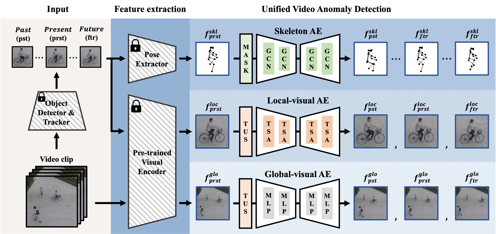

# UniVAD: Unified Video Anomaly Detection

[](https://opensource.org/licenses/MIT)
[](https://pytorch.org/)
[](http://wacv2026.thecvf.com/)

**UniVAD** is a unified framework designed to detect various types of video anomalies effectively. Unlike existing models that often focus on specific anomaly types or struggle with complex real-world scenarios, UniVAD introduces a comprehensive approach to handle diverse anomalous events.

This repository contains the official implementation of the paper **"UniVAD: Unified Video Anomaly Detection Model for Detecting Different Anomaly Types"**, accepted at **WACV 2026**.

---

## 📖 Introduction

In real-world surveillance environments, anomalies appear in various forms. To address this, UniVAD categorizes anomalies into three distinct types and proposes a unified framework to detect them simultaneously:

1.  **Human-related Anomaly:** Abnormal human behaviors (e.g., fighting, falling).
2.  **Object-related Anomaly:** Abnormalities involving objects (e.g., throwing a bag, riding a bicycle where prohibited).
3.  **Object-independent Anomaly:** Contextual or environmental deviations unrelated to specific objects.

To achieve this, UniVAD utilizes a **Tri-Branch AutoEncoder Architecture**, where each branch is specialized for learning specific features: **Skeleton**, **Local Visual**, and **Global Visual**.

---

## 🚀 Key Features

* **Tri-Branch AutoEncoder Design:**
    * **Skeleton AE:** Captures fine-grained motion patterns and human poses using extracted skeleton data.
    * **Local Visual AE:** Learns appearance-based features of individual objects to detect object-related anomalies.
    * **Global Visual AE:** Captures the global context and environmental changes within the entire frame.
* **Predictive Learning Strategy:**
    * Enhances detection accuracy by training the model to predict past and future frames based on current information, effectively identifying temporal inconsistencies.
* **SOTA Performance:**
    * Achieved **2% to 11% performance improvement** on major benchmark datasets (ShanghaiTech, UCF-Crime, etc.) compared to existing state-of-the-art methods.

---

## 🛠️ Architecture

<div align="center">
  
</div>

The model processes multi-modal inputs (Skeleton coordinates, RGB Patches, Global Frames) through parallel AutoEncoders. The final anomaly score is computed by aggregating reconstruction errors and prediction errors from all branches.

---

## 📦 Installation

This project requires **Python 3.8+** and **PyTorch**.

```bash
# 1. Clone the repository
git clone [https://github.com/kkIIun/UniVAD.git](https://github.com/kkIIun/UniVAD.git)
cd UniVAD

# 2. Install dependencies
pip install -r requirements.txt